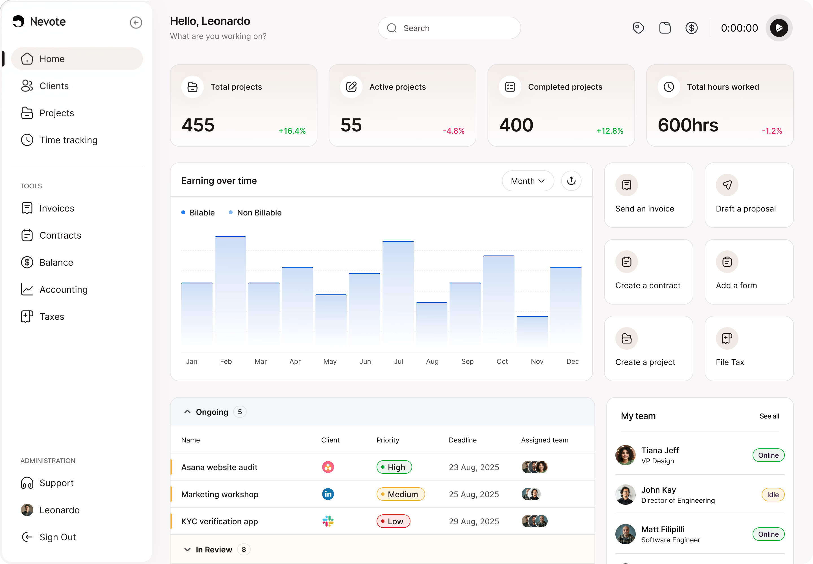

# Nevote

**Nevote** is an all-in-one SaaS platform designed to help freelancers, studios, and startups manage clients, projects, and payments without the chaos.



## 🚀 Overview

Nevote provides a unified workspace to:
- **Track Finances**: Visualize earnings, expenses, and invoices.
- **Manage Clients**: Keep all client communication and details in one place.
- **Device Sync**: Seamless experience across Mobile and Web applications.

The project features a highly polished, animated landing page with parallax scroll effects, interactive device mockups, and a modern aesthetic.

## ✨ Key Features

- **Dynamic Hero Section**: Interactive 3D-style dashboard presentation.
- **Device Toggle**: Real-time switching between Mobile and Web App views with scroll-based zoom animations.
- **Trusted Brands**: Infinite scrolling marquee with "fancy" brand icons.
- **Smooth Animations**: Custom CSS-based scroll reveal and fade-up effects.
- **Responsive Design**: Fully optimized for all screen sizes.

## 🛠️ Tech Stack

- **Framework**: React 18
- **Build Tool**: Vite
- **Styling**: Vanilla CSS3 (Variables, Flexbox/Grid, Keyframe Animations)
- **Icons**: Font Awesome 6
- **Package Manager**: pnpm

## 📦 Getting Started

1. **Clone the repository**
   ```bash
   git clone https://github.com/Kashii-00/Nevote.git
   cd Nevote
   ```

2. **Install dependencies**
   ```bash
   pnpm install
   ```

3. **Start the development server**
   ```bash
   pnpm dev
   ```

4. **Build for production**
   ```bash
   pnpm build
   ```

## 📄 License

This project is licensed under the MIT License - see the [LICENSE](LICENSE) file for details.
